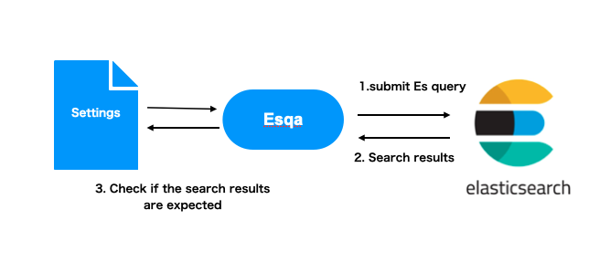

# Table of Contents

* [Overview](#Overview)
* [Install](#Install)
* [Behavior](#Behavior)
* [Usage](#Usage)
* [Configurations](#Configurations)

## Overview

**Esqa** automates the checks the qualities of the Elasticsearch indices
as the unit test frameworks such as RSpec or PyTests. Users add the test cases
into the setting files and checks if the target indices is build as expected running the command `esqa`. 

## Install

```bash
$ pip install esqa
```

## Behavior

When we run Esqa, the following steps are executed. 

1. Submit Es query to an Elasticsearch cluster 
2. Get the result ranking from Elasticsearch
3. Check if the rankings from Es cluter satisfiy the conditions described in configuration file

The following is the image.



## Usage

Esqa provides the `esqa` command which check if the queries gets the expected search rankings from Elasticsearch indices.

We run the `esqa` command specifying the configuration file and target index.

```shell
$ esqa check --config sample_config.json --index document-index
```

## Configurations

Esqa has the settings file in which we add the test cases. 
The test cases consist of two blocks *query* and *validations*.
*query* is an Elasticsearch query and *validation* is the expected behavior
when we run the defined query to the specified index.

The following is an example of the setting file of esqa.
The setting file means that results from Elasticsearch must satisfy the conditions defined in
`asserts` block when we run the defined query (searching `engineer` to the `message` field) to the target index.

```json
{
  "cases": [
    {
      "name": "match query",
      "query": {
        "query": {
          "match": {
            "message": {
              "query": "engineer"
            }
          }
        }
      },
      "asserts": [
        {
          "type": "equal",
          "rank": 0,
          "item": {
            "field": "document_id",
            "value": "24343"
          }
        }
      ]
    }
  ]
}
```

We add all the test cases into `cases` block.
Each test cases have three elements `name`, `query` and `asserts`.
`name` is the name of the test case. `query` is the target query which we want to validate.
We add a set of expected behaviors to the `asserts` block.  

The `asserts` block contains the conditions that search results from
Elasticsearch cluster must satisfy. Each condition
contains several elements `type`, `rank` and `item`. 

| Element | Summary |
| :--- | :--- |
| type | condition types (`equal`、`higher`、`lower`） |
| rank | rank of the specified item |
| item | item stored in Elasticsearch indices specified in rank element must satisfy |

`item` element specifies the document in Es indices. The item is specified with the field value.

| Element | Summary |
| :--- | :--- |
| field | field name |
| value | value of the field specified in `field` element |

## Templates

Sometimes queries in the test cases are almost the same.
In such cases, esqa provides *templates* in the configuration files.

Template files are JSON file which contains an Elasticsearch query
with **variables**.

The following is an example of template file. As we can see, `query`
block contains a variable `${query_str}`. The variables are injected
from the Esqa configuraiton file.

```json
{
  "query": {
    "match": {
      "message": {
        "query": "${query_str}"
      }
    }
  }
}
```

The following is a configuration file which specifies the template file.
To uses template files in the configuration file, we add `template` element in `query` block.
The variables in the specified template file need to be added in the `query` block.
For example the configuration file added a variable `query_str` defined in template file.

```json
{
  "templates": [
    {
      "name": "basic_query",
      "path": "tests/fixtures/default_template.json"
    }
  ],
  "cases": [
    {
      "name": "match identical",
      "query": {
        "template": "basic_query",
        "query_str": "engineer"
      },
      "asserts": [
        {
          "type": "equal",
          "rank": 0,
          "item": {
            "field": "id",
            "value": "2324"
          }
        }
      ]
    }
  ]
}
```