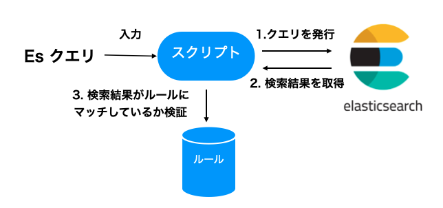

# 目次
* [概要](#概要)
* [設定](#設定)
* [CLI](#CLI)
* [実装](#実装)

# 概要

検索精度についての自動QAテストを走らせるための方法について検討した文書です。

自動テストでは検証対象のElasticsearch (Es) インデクス、インデクスに投げるクエリ、上位に出てきてほしい（もしくは出てきてほしくはない）文書を記したルール
からなる３つの要素が必要になります。

* Es インデクス: Elasticsearchに含まれる文書集合をインデクスしたもの。クエリにヒットする文書を取り出せる
* クエリ：Esクエリ。クエリの結果はインデクスに存在する文書であり、関連性によってランキングされている
* ルール: 指定したクエリを発行したときに検索結果に出てきてほしい（出てきてほしくない）文書（集合）およびランキングを指定します。例えば文書IDが2332が1位にランキングされるというのは一つのルールです

自動テストスクリプトは上記の３つの要素を使って、発行したEsクエリが期待した結果を返しているかをチェックします。

具体的には、スクリプトは以下の流れで処理を実行します。

0. クエリと検索結果が満たすべきルールを取得する
1. 指定されたクエリを発行する
2. Es から結果を取得する
3. Esからの結果がルールに記載されている通りになっているかチェックする



# 設定

スクリプトが単一のクエリとそれが満たすべきルールしか持たないのであればシンプルなのですが、
通常検索システムでは精度を確認したいクエリ、ルールは複数存在します。
そのためスクリプトは設定ファイルをサポートし、ユーザが設定ファイルにクエリとルールを記述するようにします。

ユーザはEsクエリと、期待する結果の条件をJSONで記述します。JSONにはテストケースを追加してゆきます。
テストケースは `cases` 要素に追加します。以下は設定サンプルです。

```json
{
  "cases": [
    {
      "name": "match query",
      "query": {
        "query": {
          "match": {
            "message": {
              "query": "I am an engineer"
            }
          }
        }
      },
      "asserts": [
        {
          "type": "equal",
          "rank": 0,
          "item": {
            "field": "document_id",
            "value": "24343"
          }
        }
      ]
    }
  ]
}
```

## 設定項目

テストケースの各要素は3つの要素（`name`、`query`、`asserts`）を持ちます。

| 要素 | 概要 |
| :--- | :--- |
| name | テストケース名 |
| query | テストで発行するEsクエリ |
| asserts | 検索結果が満たすべき条件（一位の文書のIDなどを指定）|

`assert` ブロックはリストであり、各要素は検索ランキングが満たす一つの条件を示します。
各要素は以下の要素からなります。

| 要素 | 概要 |
| :--- | :--- |
| type | 条件のタイプ（`equal`、`higher`、`lower`） |
| rank | テスト対象の検索ランキング |
| item | rank で指定したアイテムが満たすべき条件（IDなどのフィールドを指定）|

## クエリテンプレート

これまで解説してきたテストケースのなかでクエリ（`query`) ブロックはテストケースごとに一部しか異なりません。
そこで、クエリテンプレートを用意して、それを使って記述量を減らします。クエリテンプレートはJSONファイルで
一部が変数を代入できるようになっています。

```json
{
  "query": {
    "match": {
      "message": {
        "query": {{ query_str }}
      }
    }
  }
}
```

クエリテンプレートをつかう場合、テンプレートファイルの指定とテンプレートに含まれる変数を指定します。これにより `query`
ブロックの記述量がへりテストケースを追加するコストが低減できます。

```json
{
  "cases": [
    {
      "name": "完全一致クエリ",
      "query": {
        "template": "default_template.json",
        "query_str": "カーオーディオ"
      },
      "asserts": [
        {
          "type": "equal",
          "rank": 0,
          "item": {
            "field": "id",
            "value": "doc-2324"
          }
        }
      ]
    },
    {
      "name": "よみクエリ",
      "query": {
        "template": "default_template.json",
        "query_str": "かーおーでぃお"
      },
      "asserts": [
        {
          "type": "equal",
          "rank": 0,
          "item": {
            "field": "doc_id",
            "value": "doc-2324"
          }
        }
      ]
    }
  ]
}
```

# CLI

自動テストツールはCLIコマンド（`es_qa_test`）をサポートし以下のように使います。引数にはルールファイルに加えてEsに関する情報
（インデクス名、インデクスを保持するホスト名とポート番号）を指定します。

```bash
$ esqa rule.json --index search_symptom_word --host localhsot --port 9200
```

# 実装

以下の環境で実装する予定です。

* 記述言語はPythonを考えています。DSチームが理解しやすいので。
* ライブラリ：Elasticsearch client for Python、Jinjal（テンプレートエンジン）

## References

* [How to pass variable to JSON, for python?](https://stackoverflow.com/questions/62195181/how-to-pass-variable-to-json-for-python)